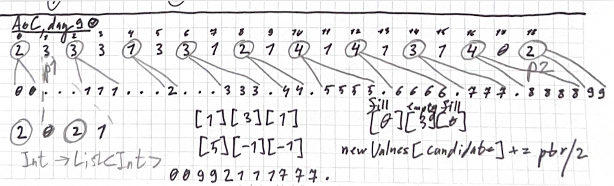

# Day 9: Disk Fragmenter

<p align="center">
  
</p>

## Intuition

### Problem Understanding
The problem simulates disk defragmentation in two different ways:

1. Part 1 (Block-level defragmentation):
- Input like "2333133121414131402" represents alternating file sizes and free spaces
- Each file gets an ID (0, 1, 2, etc.) based on its position from left to right
- Files need to be compacted by moving individual blocks one at a time
- For example, in "2333", the first "2" means a file of size 2, the first "3" means 3 free spaces

2. Part 2 (File-level defragmentation):
- Same input format but moves entire files at once
- Files must be moved in descending order of file IDs
- A file can only move if there's enough contiguous free space to its left

## Approach

### Part 1: Block-by-Block Movement

#### Input Processing
```kotlin
val blocks = input.withIndex().fold(mutableListOf<Int>()) { acc, p ->
    acc.also {
        acc += (if ((p.index and 1) == 0) p.index / 2 else -1).repeat(p.value.code - '0'.code)
    }
}
```
- Uses `withIndex()` to track both position and value in input string
- Even indices (index and 1 == 0) represent file blocks
- Odd indices represent free spaces (marked as -1)
- `repeat()` expands each number into the specified number of blocks

#### Moving Algorithm
```kotlin
var p1 = 0
var p2 = blocks.lastIndex
while (p1 < p2) {
    if (blocks[p1] != -1) { p1++; continue }
    if (blocks[p2] == -1) { p2--; continue }
    blocks[p1] = blocks[p2]
    blocks[p2] = -1
    p1++
    p2--
}
```
- Uses two pointers moving towards each other
- Left pointer (p1) looks for free space (-1)
- Right pointer (p2) looks for file blocks
- When both are found, swaps them
- Continues until pointers meet

### Part 2: File-Level Movement

#### Data Structure Setup
```kotlin
val blocks = input.map { c -> mutableListOf(c.code - '0'.code) }
val newIndices = Array(blocks.size) { mutableListOf<Int>() }
```
- Maintains two parallel structures:
    1. `blocks`: Tracks file and free space sizes
    2. `newIndices`: Tracks file IDs for each position

#### File Movement Logic
```kotlin
while (ptr > 0) {
    var candidate = 1
    while (candidate < ptr) {
        if (blocks[candidate].last() >= blocks[ptr].last()) break
        candidate += 2
    }
    if (candidate < ptr) {
        // Move file and update structures
        val currentEmpty = blocks[candidate].removeAt(blocks[candidate].lastIndex)
        blocks[candidate] += listOf(0, blocks[ptr].last(), currentEmpty - blocks[ptr].last())
        // ...
    }
    ptr -= 2
}
```
- Processes files from right to left
- For each file:
    1. Finds leftmost free space that can fit the file
    2. Updates both blocks and indices when moving
    3. Maintains the remaining free space after movement

#### Example Movement
For input "2333":
1. Initial state: `[2,3,3,3]` → `[00,---,111,---]`
2. After moving file 1: `[00,111,---,---]`

## Complexity

### Part 1
- Time Complexity: $$O(n)$$
    - Input processing: $$O(n)$$ for string traversal
    - Block movement: $$O(n)$$ for two-pointer traversal
    - Each block is moved at most once
    - Checksum calculation: $$O(n)$$ for final traversal

- Space Complexity: $$O(n)$$
    - Main storage: blocks array of size proportional to input
    - No additional significant space needed

### Part 2
- Time Complexity: $$O(n^2)$$
    - Input processing: $$O(n)$$
    - File movement: $$O(n^2)$$
        - For each file ($$O(n)$$), potentially scan all free spaces ($$O(n)$$)
    - Final processing and checksum: $$O(n)$$

- Space Complexity: $$O(n)$$
    - blocks array: $$O(n)$$
    - newIndices array: $$O(n)$$