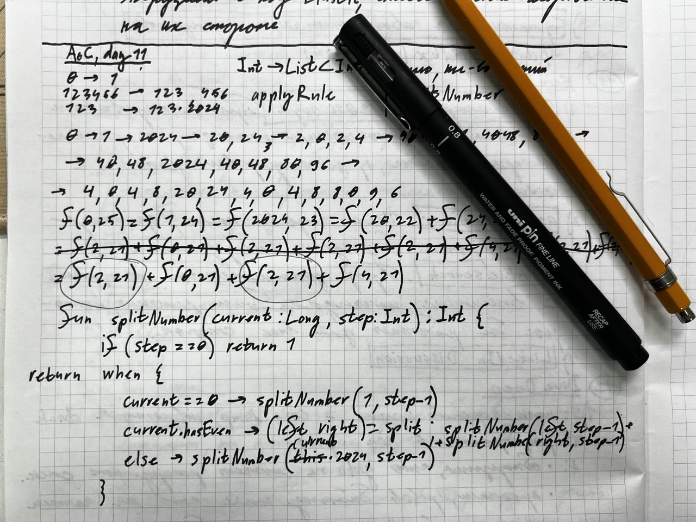

# Day 11: Plutonian Pebbles

This is quite an interesting task that combines number manipulation with recursive pattern recognition.

  

## Intuition
The key insight is recognizing that this problem follows a recursive pattern where each number transforms based on certain rules, potentially splitting into multiple numbers. The challenge lies in:

1. Handling the exponential growth efficiently
2. Recognizing that we need to track the count of stones rather than the actual numbers
3. Understanding that caching can prevent redundant calculations

## Approach

### Core Components

1. **Number Properties**
    - `numberOfDigits`: Calculates digits in a number
    - `hasAnEvenNumberOfDigits`: Checks if the digit count is even
    - `split()`: Splits a number into two halves when it has even digits

2. **Main Algorithm**
    - Uses recursive function with caching to compute the number of stones
    - Each number transforms according to three rules:
        - If 0 -> becomes 1
        - If even number of digits -> splits into two numbers
        - Otherwise -> multiplies by 2024

3. **Optimization Techniques**
    - Memoization using a HashMap to cache results
    - Cache key combines the current number and remaining steps
    - This prevents recalculating the same transformations multiple times

## Time Complexity

### Space Complexity: $$O(N * S)$$
- N = Number of unique numbers generated
- S = Number of steps
- The cache stores results for each number-step combination

### Time Complexity: $$O(N * S * D)$$
- N = Number of unique numbers generated
- S = Number of steps
- D = Maximum number of digits in any number
- Each number might need to be processed for digit counting and splitting

The actual performance is much better than brute force ($$O(2^S)$$) due to:
1. Memoization preventing redundant calculations
2. Cache hits reducing the effective number of operations
3. The bounded nature of number transformations

## Key Insights
What makes this solution elegant is how it transforms an exponentially growing problem into a manageable one through:
1. Focus on counting rather than tracking actual numbers
2. Smart use of caching to avoid redundant work
3. Efficient number manipulation using basic arithmetic operations