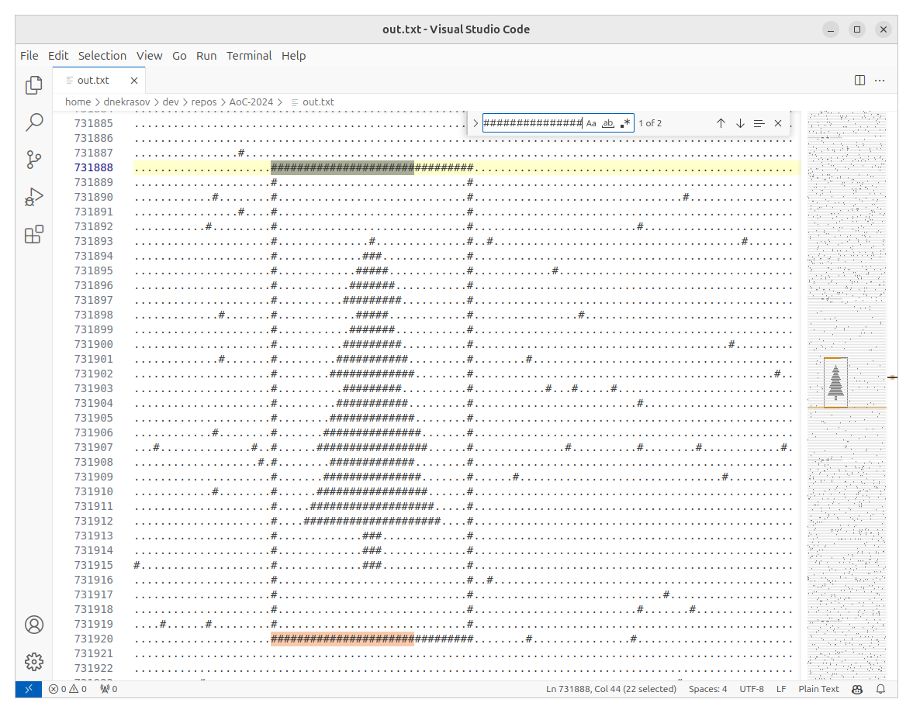

# Day 14: Restroom Redoubt

  

## Intuition & Approach

### Part 1
The key insight is that robot positions can be calculated directly for any given time without simulating each step, since:
1. Motion is linear and wraps around predictably
2. The final position can be computed using modular arithmetic
3. Each robot moves independently, so no need to track collisions

The approach:
1. For each robot, calculate its position at t=100 using the formula:
    - `new_x = (x + dx * TIME) mod width`
    - `new_y = (y + dy * TIME) mod height`
2. Count robots in each quadrant, excluding the middle lines
3. Multiply the counts together

## Part 2
The approach here is brute force but pragmatic:
1. Simulate robot movements and print each state to a file
2. Use pattern matching to find the Christmas tree formation
3. Visual inspection to identify the correct time step

Clever insight: Using a text editor's search functionality to identify patterns is an efficient way to spot the tree formation without writing complex pattern recognition code.

## Time Complexity

### Part 1
- Time: $$O(n)$$ where n is number of robots
    - Single pass to calculate final positions
    - Single pass to count quadrants
- Space: $$O(n)$$ to store final positions

### Part 2
- Time: $$O(t * n)$$ where:
    - t is number of time steps simulated (15000)
    - n is number of robots
- Space: $$O(w * h)$$ where:
    - w is width of grid (101)
    - h is height of grid (103)
    - Plus file storage for output

The file-based approach trades computational efficiency for human pattern recognition capability, which is very effective for this specific problem.