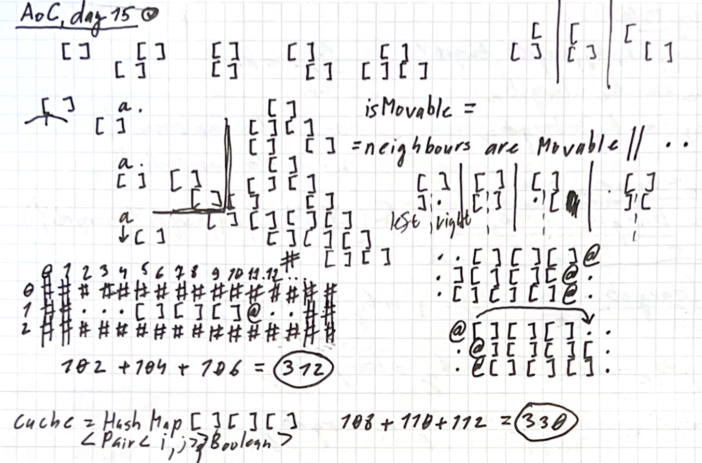

# Day 15: Warehouse Woes

<p align="center">
  
</p>

## Core Problem Understanding
The puzzle presents a warehouse simulation with two key challenges:
1. Part 1: Moving a robot that can push single-width boxes
2. Part 2: Same robot moving double-width boxes

## Key Components Analysis

### State Representation
- Grid represented as `List<CharArray>`
- Part 1: Boxes represented as 'O'
- Part 2: Wide boxes represented as '[]' pairs

### Movement Logic
The solution implements two distinct movement strategies:

#### Part 1: Simple Box Movement
```kotlin
fun List<CharArray>.shift(startI: Int, startJ: Int, di: Int, dj: Int): Pair<Int, Int>
```
- Uses linear scanning along movement direction
- Follows boxes until finding empty space or obstacle
- Time Complexity: $$O(n)$$ where n is grid dimension
- Space Complexity: $$O(1)$$

#### Part 2: Complex Box Movement
Two main components:

1. Horizontal Movement
```kotlin
fun List<CharArray>.shiftHorizontal(startI: Int, startJ: Int, dj: Int): Pair<Int, Int>
```
- Handles wide box movement along rows
- Manages box orientation ('[]' vs '][')
- Time Complexity: $$O(n)$$
- Space Complexity: $$O(1)$$

2. Vertical Movement (DFS-based)
```kotlin
fun List<CharArray>.isMovable(i: Int, j: Int, di: Int): Boolean
```
- Uses DFS to check if movement is possible
- Caches results to prevent redundant calculations
- Handles complex box dependencies

### DFS Deep Dive

The DFS implementation in `isMovable` is particularly interesting:

1. **Base Cases**:
    - '@' (robot): Checks direct movement or box pushing
    - '[' (left side of box): Checks both left and right sides
    - Bottom-most position: Returns true if space is empty

2. **Recursive Cases**:
    - For robot pushing box: Recursively checks if box can move
    - For box: Recursively checks both parts can move

3. **Caching Strategy**:
```kotlin
val cache = HashMap<Pair<Int, Int>, Boolean>()
```
- Caches position results
- Prevents exponential time complexity
- Cache cleared before each vertical movement

### Time Complexity Analysis

#### Without Caching
- Worst case: $$O(2^n)$$ where n is grid height
- Each position could branch into two recursive calls
- Would be impractical for large grids

#### With Caching
- Time Complexity: $$O(n^2)$$
- Each position visited at most once
- Cache lookup/storage: $$O(1)$$
- Total positions: n * n

### Space Complexity
- Grid Storage: $$O(n^2)$$
- Cache: $$O(n^2)$$
- Recursion Stack: $$O(n)$$
- Total: $$O(n^2)$$

## Optimization Techniques

1. **Cache Management**
- Cache cleared between movements
- Prevents invalid cached states
- Maintains movement independence

2. **Movement Ordering**
```kotlin
val sortedPoints = cache.keys.sortedBy { it.first }
```
- Ensures correct movement sequence
- Prevents box collisions
- Critical for maintaining grid consistency

## Key Insights

1. **Part 1 vs Part 2 Approach**
- Part 1: Linear scanning sufficient
- Part 2: Requires graph traversal (DFS)
- Different complexity classes

2. **State Management**
- Grid mutated in place
- Position tracking via return values
- Box orientation handling

3. **Edge Cases**
- Box boundaries
- Wall collisions
- Multiple box interactions

## Testing Strategy
- Unit tests for specific scenarios
- Edge case validation