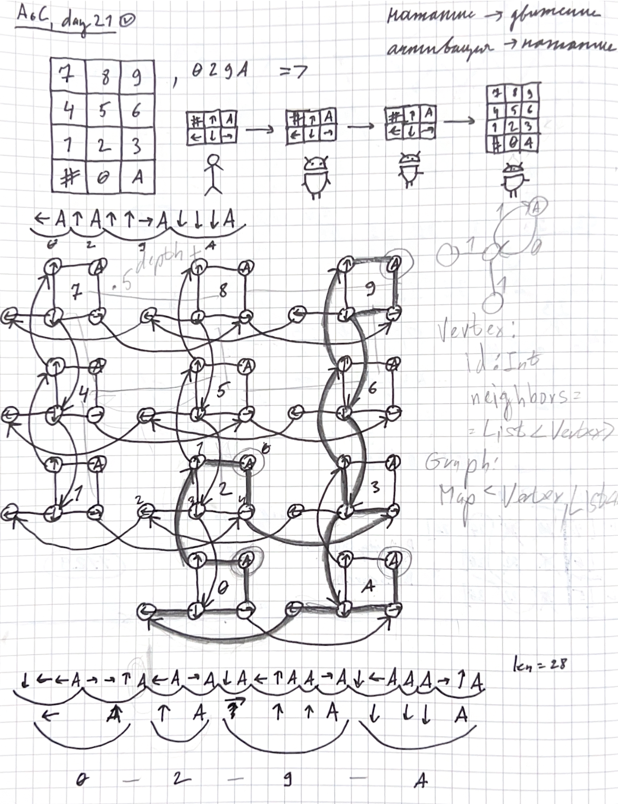
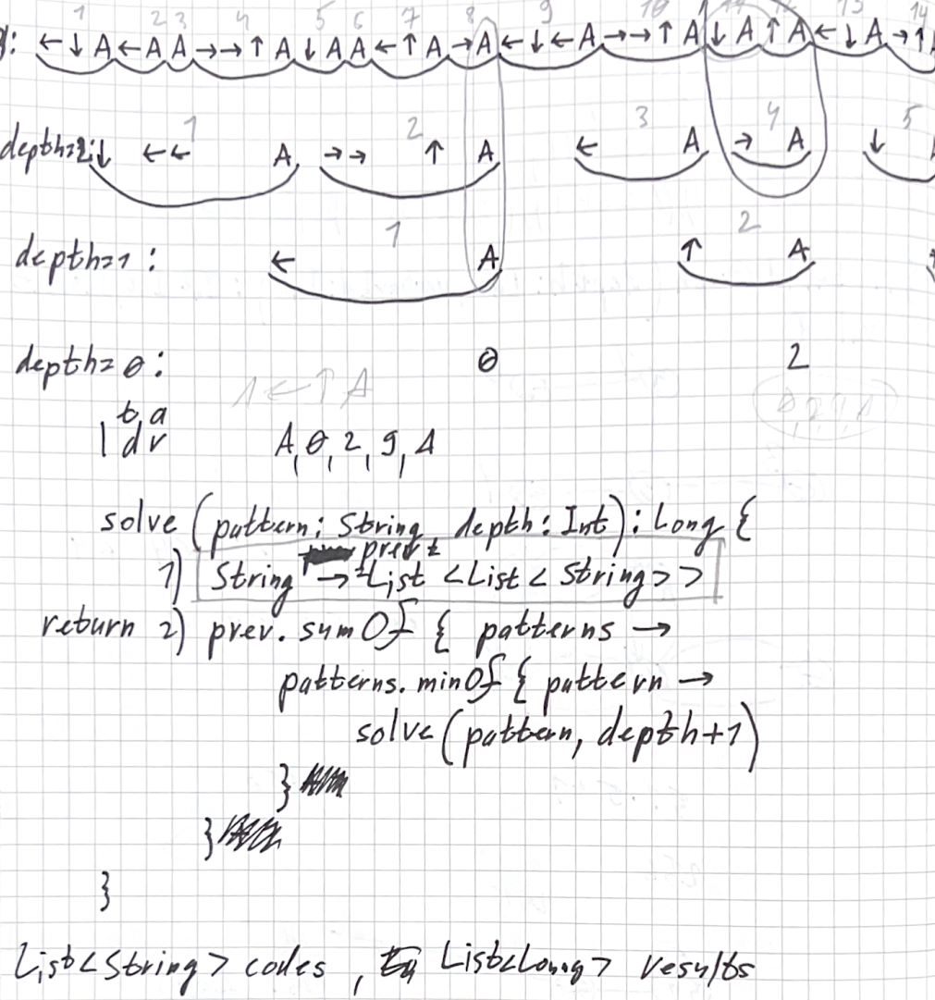

# Day 21: Keypad Conundrum

## Intuition

The problem presents a unique nested keypad system where multiple robots control each other through directional keypads to ultimately type codes on a numeric keypad. The key insights are:

1. For Part 1, we have a chain of 3 keypads (1 for us, 2 for robots) leading to the final numeric keypad
2. Each robot starts with its arm pointing at 'A' and must never point at empty spaces
3. The complexity is calculated by multiplying the numeric part of the code with the minimum number of button presses
4. Part 2 extends this to 26 keypads (1 for us, 25 for robots)

## Approach

### Part 1: Graph-based Solution

<p align="center">
  
</p>

1. **Graph Construction**
    - Create a graph representing possible transitions between buttons
    - Each vertex in the graph represents a state of the robot's arm position
    - Build vertices recursively based on the depth (number of robots)
   ```kotlin
   fun buildVertex(depth: Int, id: Long): Vertex {
       if (depth == 0) return Vertex(id, id, id, id, id)
       // Recursively build vertices for each direction
       val a = buildVertex(depth - 1, id * 5 + deltaA)
       val up = buildVertex(depth - 1, id * 5 + deltaUP)
       // ...
   }
   ```

2. **Distance Calculation**
    - Use BFS to find shortest paths between vertices
    - Calculate distances between consecutive digits in each code
   ```kotlin
   fun HashMap<Long, MutableList<Long>>.distance(start: Long, end: Long): Int {
       val queue: Queue<Pair<Long, Int>> = LinkedList()
       // Standard BFS implementation
   }
   ```

### Part 2: Dynamic Programming with Path Generation

<p align="center">
  
</p>

1. **Path Generation**
    - Generate all possible paths between two points on a keypad
    - Use DFS to explore possible movements
   ```kotlin
   fun List<String>.generateAllPossiblePaths(start: Pair<Int, Int>, end: Pair<Int, Int>, distance: Int): List<String>
   ```

2. **Recursive Solution with Memoization**
    - Use dynamic programming to avoid recalculating answers for (code to depth) pairs
    - Cache results based on code and depth
   ```kotlin
   fun solve(code: String, depth: Int = 0): Long {
       if (depth == maxDepth) return code.length.toLong()
       return cache.getOrPut(code to depth) {
           // Calculate minimum path lengths recursively
       }
   }
   ```

## Complexity

### Part 1
- Time Complexity: $$O(N * V * E)$$
    - N = number of codes
    - V = number of vertices in the graph
    - E = number of edges
- Space Complexity: $$O(V + E)$$
    - Space needed to store the graph

### Part 2
- Let S = number of possible sequences on a single keypad
- Let D = number of depths (26 in this case)
- Let N = number of input codes
- Time Complexity: $$O(S * D * N)$$
    - Each unique state is computed once due to memoization
    - For each state, we need to calculate minimum path lengths ($$O(1)$$ with cache)

- Space Complexity: $$O(S * D)$$
    - We store each unique (code, depth) combination once in the cache