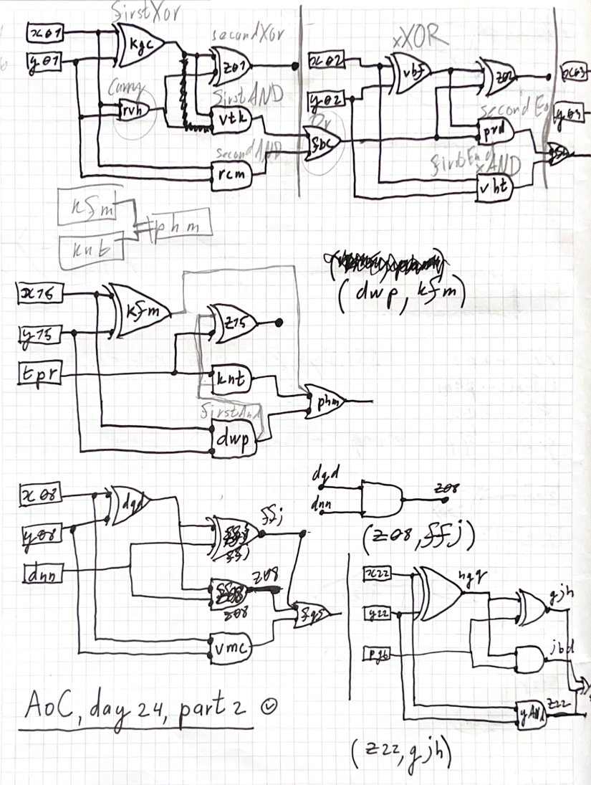

# Day 24: Crossed Wires

  

## Intuition
The puzzle presents two key challenges: simulating a circuit of boolean logic gates (Part 1) and debugging a binary adder circuit (Part 2). The first part requires implementing basic logic gates (AND, OR, XOR) and evaluating them in the correct order. The second part reveals that the circuit is actually a binary adder with some incorrectly wired connections.

## Approach

### Part 1
1. Parse the input into two maps:
    - Initial wire values (`unary`)
    - Gate connections (`binary`)
2. Create an object-oriented representation of the circuit using two node types:
    - `Unary`: Represents a wire with a constant value
    - `Binary`: Represents a logic gate with two inputs and an operation
3. Build the circuit recursively, creating nodes as needed and caching them in a HashMap
4. Find all wires starting with 'z', sort them in descending order (most significant bit first)
5. Evaluate the circuit by performing a fold operation to build the final decimal number

### Part 2
This part uses a more analytical approach rather than brute force:

1. Build a graph representation of the circuit where:
    - Vertices are wires
    - Edges represent connections between wires through gates
2. For each bit position, analyze the structure of a correct binary adder:
    - Each bit requires two inputs (x and y)
    - Should have specific patterns of XOR and AND gates
    - Carry bits should propagate correctly
3. The solution identifies anomalies where the circuit structure doesn't match the expected binary adder pattern
4. Manual inspection of these anomalies helped identify the pairs of wires that needed to be swapped

The final solution required human intervention to analyze the debugger output and determine the correct wire swaps, making this more of an interactive debugging process than a purely algorithmic solution.

## Complexity

### Part 1
- Time: $$O(N)$$ where N is the number of gates in the circuit
- Space: $$O(N)$$ to store the nodes and their connections

### Part 2
- Time: $$O(N + M)$$ where N is the number of gates and M is the number of bits to analyze
- Space: $$O(N)$$ for storing the graph representation

Note that the Part 2 complexity analysis only covers the automated portion of the solution, as the final wire swaps were determined through manual debugging.

## Special Note
The Part 2 solution is particularly interesting because it demonstrates a hybrid approach combining automated analysis with human debugging. While it successfully solves the puzzle, it's worth noting that it's not a fully automated solution. This approach mirrors real-world debugging scenarios where automated tools help identify issues, but human insight is needed to make the final connections and corrections.